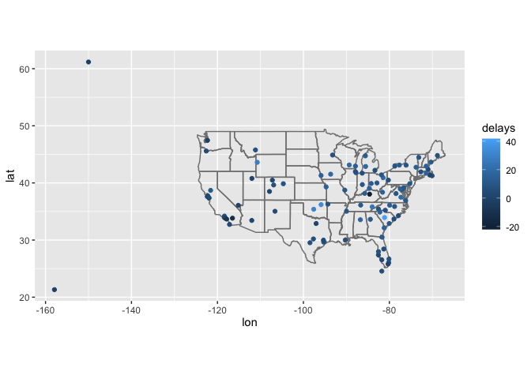
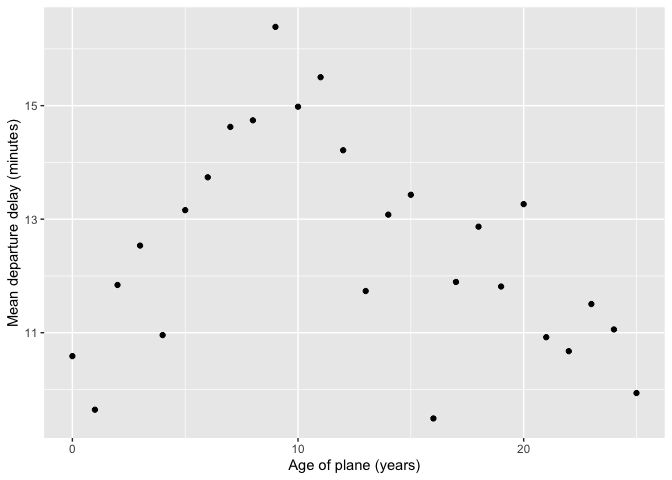
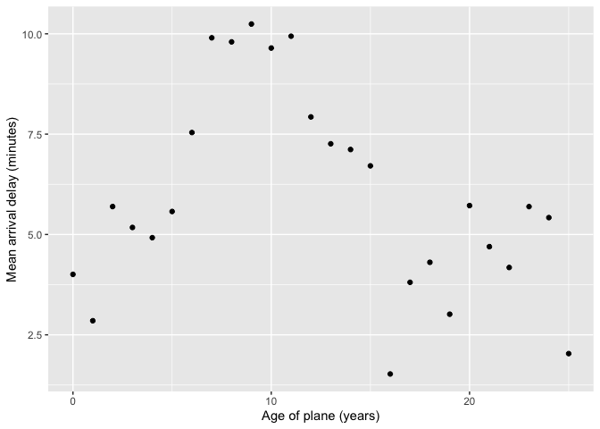
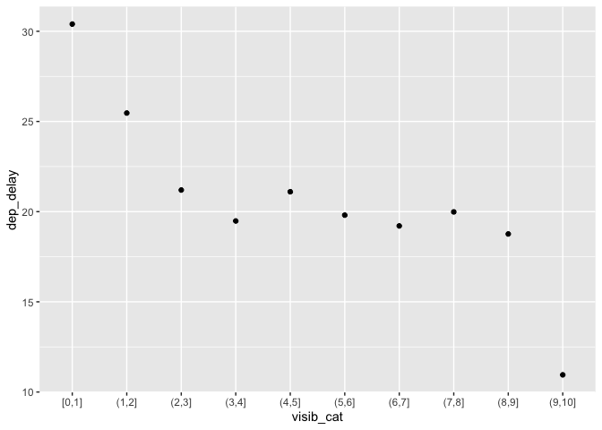
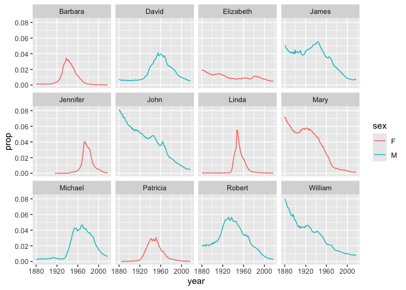

# lab7


## **Exercise 1: Exploration of the `nycflights13` data (50 min)**

We will start out with some further exploration of the datasets included
in the `nycflights13` package that we worked with in Wednesday’s
lecture.

Let’s first load in the required packages and data

``` r
library(tidyverse)
library(knitr)
library(nycflights13) 

flights |> head() |> kable()
```

| year | month | day | dep_time | sched_dep_time | dep_delay | arr_time | sched_arr_time | arr_delay | carrier | flight | tailnum | origin | dest | air_time | distance | hour | minute | time_hour |
|---:|---:|---:|---:|---:|---:|---:|---:|---:|:---|---:|:---|:---|:---|---:|---:|---:|---:|:---|
| 2013 | 1 | 1 | 517 | 515 | 2 | 830 | 819 | 11 | UA | 1545 | N14228 | EWR | IAH | 227 | 1400 | 5 | 15 | 2013-01-01 05:00:00 |
| 2013 | 1 | 1 | 533 | 529 | 4 | 850 | 830 | 20 | UA | 1714 | N24211 | LGA | IAH | 227 | 1416 | 5 | 29 | 2013-01-01 05:00:00 |
| 2013 | 1 | 1 | 542 | 540 | 2 | 923 | 850 | 33 | AA | 1141 | N619AA | JFK | MIA | 160 | 1089 | 5 | 40 | 2013-01-01 05:00:00 |
| 2013 | 1 | 1 | 544 | 545 | -1 | 1004 | 1022 | -18 | B6 | 725 | N804JB | JFK | BQN | 183 | 1576 | 5 | 45 | 2013-01-01 05:00:00 |
| 2013 | 1 | 1 | 554 | 600 | -6 | 812 | 837 | -25 | DL | 461 | N668DN | LGA | ATL | 116 | 762 | 6 | 0 | 2013-01-01 06:00:00 |
| 2013 | 1 | 1 | 554 | 558 | -4 | 740 | 728 | 12 | UA | 1696 | N39463 | EWR | ORD | 150 | 719 | 5 | 58 | 2013-01-01 05:00:00 |

#### **Question 1: Compute the average delay by destination, then join on the `airports` data frame so you can show the spatial distribution of delays. Here’s an easy way to draw a map of the United States:**

``` r
library(maps)

average_delays_by_destination <-flights |>
  group_by(dest) |>
  summarize(delays = mean(arr_delay, na.rm = TRUE)) |>
  inner_join(airports, by=c(dest="faa"))

average_delays_by_destination |>
  ggplot(mapping=aes(lon, lat, color=delays)) +
  borders("state") +
  geom_point() +
  coord_quickmap()
```



#### **Question 2: Is there a relationship between the age of a plane and its delays?**

Hint: Think about which of our datasets have relevant information and
how we need to connect them.

``` r
plane_cohort <- inner_join (flights, select(planes, tailnum, year), by="tailnum", suffix=c("_flight", "_plane")) |>
  mutate(age=year_flight - year_plane) |>
  filter(!is.na(age)) |>
  mutate(age=if_else(age>25, 25L, age)) |>
  group_by(age) |>
  summarize (departure_delay_mean = mean(dep_delay, na.rm = TRUE), arrival_delay_mean = mean(arr_delay, na.rm = TRUE))

#departure delays
plane_cohort |> 
  ggplot () +
  geom_point(mapping=aes(x=age, y=departure_delay_mean)) +
  scale_x_continuous("Age of plane (years)", breaks = seq(0, 30, by = 10)) +
  scale_y_continuous("Mean departure delay (minutes)")
```



``` r
#arrival delays 
plane_cohort |>
  ggplot() +
  geom_point(mapping=aes(x=age, y=arrival_delay_mean)) +
  scale_x_continuous("Age of plane (years)", breaks = seq(0, 30, by = 10)) +
  scale_y_continuous("Mean arrival delay (minutes)")
```



#### **Question 3: What weather conditions make it more likely to see a delay?**

Hint: Think about which of our datasets have relevant information and
how we need to connect them.

``` r
weather_condition <- flights |>
  inner_join(weather, by=c("origin", "year", "month", "day", "hour"))

#precipitation
weather_condition |>
  group_by(precip) |>
  summarize(delay=mean(dep_delay, na.rm=TRUE)) |>
  ggplot(mapping=aes(x=precip, y=delay)) +
  geom_line() +
  geom_point ()
```


``` r
#visibility
weather_condition |>
  ungroup() |>
  mutate(visib_cat=cut_interval(visib, n=10)) |>
  group_by (visib_cat) |>
  summarize (dep_delay = mean(dep_delay, na.rm= TRUE))|>
  ggplot () +
  geom_point (mapping=aes(x=visib_cat, y=dep_delay))
```



## Exercise **2: Baby names (45 min)**

Use data tidying, transformation, and visualization to answer the
following questions about baby names in breakout rooms

``` r
library(babynames)

babynames |>
  head() |>
  kable()
```

| year | sex | name      |    n |      prop |
|-----:|:----|:----------|-----:|----------:|
| 1880 | F   | Mary      | 7065 | 0.0723836 |
| 1880 | F   | Anna      | 2604 | 0.0266790 |
| 1880 | F   | Emma      | 2003 | 0.0205215 |
| 1880 | F   | Elizabeth | 1939 | 0.0198658 |
| 1880 | F   | Minnie    | 1746 | 0.0178884 |
| 1880 | F   | Margaret  | 1578 | 0.0161672 |

- The `babynames` dataset provides the number of children of each sex
  given each name from 1880 to 2017 in the US. All names with more than
  5 uses are included. This dataset is provided by the US Social
  Security Administration.

- As a reminder, to get familar with this dataset, you might want to use
  functions like `View()`, `dim()`, `colnames()` , and `?`.

- Make sure that you use figures and/or tables to support your answer.

- We provide some possible solutions for each question, but we highly
  recommend that you **don’t look at them unless you are really stuck**.

#### **Question 1: What are the 6 most popular boy names and girl names of all time? How has the popularity of each of these names changed over time? This time, use the `slice_max()` function in combination with a `join` function to answer this question.**

*Hint: You can start by finding the 6 most popular names for each sex in
one step using `group_by()` and `slice_max()`, and then use a filtering
join function to subset the original dataset.*

``` r
top_six_popular_names <- babynames |>
  group_by(sex, name) |>
  summarize(total_count = sum(n)) |>
  ungroup() |>
  group_by(sex) |>
  slice_max(order_by=total_count, n=6)

babynames |>
  semi_join(top_six_popular_names, by = c("sex", "name")) |>
  ggplot() +
  geom_line(mapping=aes(x=year, y=prop, group=name, color=sex)) +
  facet_wrap(~name)
```


