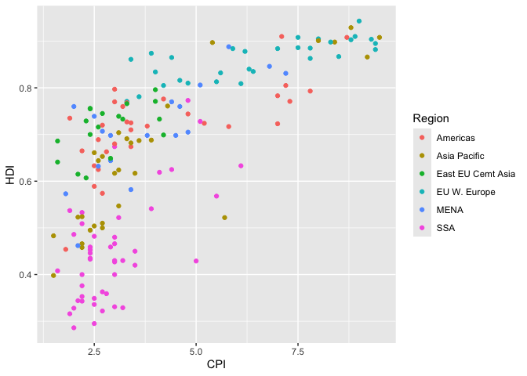
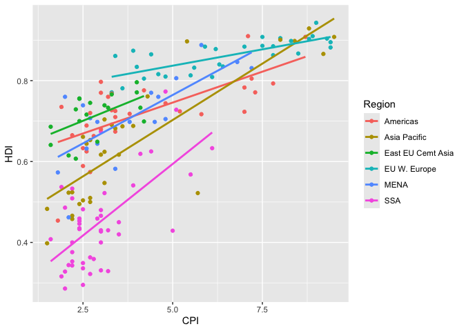
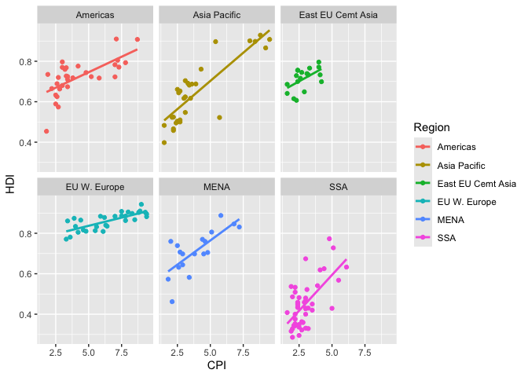
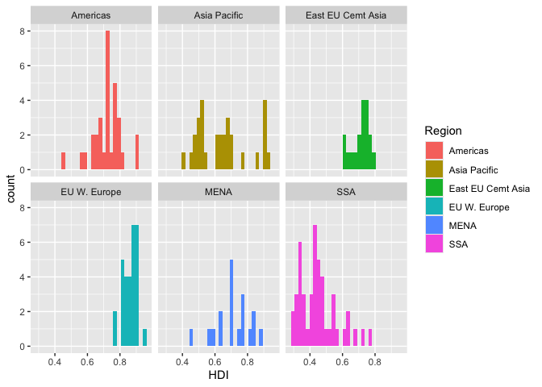
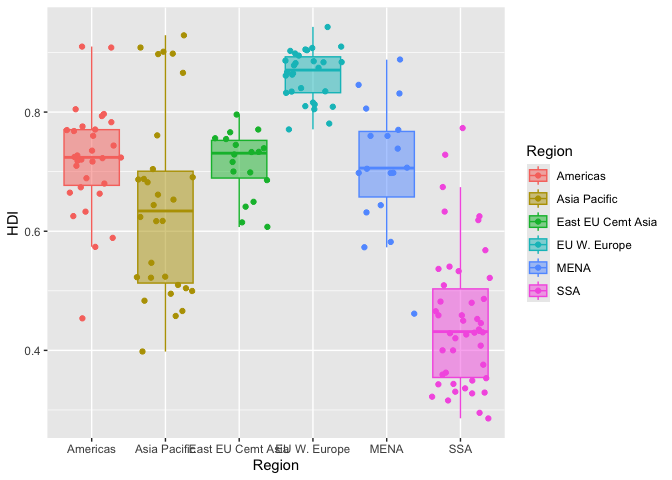

# assignment_1


``` r
library(tidyverse)
library(knitr)
```

## **Exercise 1. Corruption and human development**

This exercise explores a dataset containing the human development index
`HDI` and corruption perception index `CPI` of 173 countries across 6
different regions around the world: Americas, Asia Pacific, Eastern
Europe and Central Asia `East EU Cemt`, Western Europe `EU W. Europe`,
Middle East and North Africa and Noth Africa `MENA`, and Sub-Saharan
Africa `SSA`. (Note: the larger `CPI` is, the less corrupted the country
is perceived to be.)

First, we load the data using the following code.

``` r
economist_data <- read_csv("https://raw.githubusercontent.com/nt246/NTRES-6100-data-science/master/datasets/EconomistData.csv")
```

#### **1.1 Show the first few rows of `economist_data`**.

``` r
kable(head(economist_data))
```

|  …1 | Country     | HDI.Rank |   HDI | CPI | Region            |
|----:|:------------|---------:|------:|----:|:------------------|
|   1 | Afghanistan |      172 | 0.398 | 1.5 | Asia Pacific      |
|   2 | Albania     |       70 | 0.739 | 3.1 | East EU Cemt Asia |
|   3 | Algeria     |       96 | 0.698 | 2.9 | MENA              |
|   4 | Angola      |      148 | 0.486 | 2.0 | SSA               |
|   5 | Argentina   |       45 | 0.797 | 3.0 | Americas          |
|   6 | Armenia     |       86 | 0.716 | 2.6 | East EU Cemt Asia |

#### **1.2 Expore the relationship between human development index (`HDI`) and corruption perception index (`CPI`) with a scatter plot as the following.**

``` r
economist_data |>
  ggplot() +
  geom_point(mapping=aes(x=CPI, y=HDI))
```


#### **1.3 Make the color of all points in the previous plot red.**

``` r
economist_data |>
  ggplot() +
  geom_point(mapping=aes(x=CPI, y=HDI), color="red")
```


#### **1.4 Color the points in the previous plot according to the `Region` variable, and set the size of points to 2.**

``` r
economist_data |>
  ggplot() +
  geom_point(mapping=aes(x=CPI, y=HDI, color=Region))
```



#### **1.5 Set the size of the points proportional to `HDI.Rank`**

``` r
economist_data |>
  ggplot() +
  geom_point(mapping=aes(x=CPI, y=HDI, color=Region, size=HDI.Rank))
```


#### **1.6 Fit a smoothing line to all the data points in the scatter plot from Excercise 1.4**

``` r
economist_data |>
  ggplot() +
  geom_point(mapping=aes(x=CPI, y=HDI, color=Region)) +
  geom_smooth(mapping=aes(x=CPI, y=HDI))
```


#### **1.7 Fit a separate straight line for each region instead, and turn off the confidence interval.**

``` r
economist_data |>
  ggplot(mapping=aes(x=CPI, y=HDI, color=Region)) +
  geom_point() +
  geom_smooth(se=FALSE, method="lm")
```

    `geom_smooth()` using formula = 'y ~ x'



#### **1.8 Building on top of the previous plot, show each `Region` in a different facet.**

``` r
economist_data |>
  ggplot(mapping=aes(x=CPI, y=HDI, color=Region)) +
  geom_point() +
  geom_smooth(se=FALSE, method="lm") +
  facet_wrap(~Region)
```

    `geom_smooth()` using formula = 'y ~ x'



#### **1.9 Show the distribution of `HDI` in each region using density plot. Set the transparency to 0.5**

``` r
economist_data |>
  ggplot() +
  geom_density(mapping=aes(x=HDI, fill=Region), alpha=0.5) +
  labs (x="HDI", y="density")
```


#### **1.10 Show the distribution of `HDI` in each region using histogram and facetting.**

``` r
economist_data |>
  ggplot() +
  geom_histogram(mapping=aes(x=HDI, fill=Region)) +
  facet_wrap(~Region) +
  labs (x="HDI", y="count")
```



#### **1.11 Show the distribution of `HDI` in each region using a box plot. Set the transparency of these boxes to 0.5 and do not show outlier points with the box plot. Instead, show all data points for each country in the same plot. (Hint: `geom_jitter()` or `position_jitter()` might be useful.)**

``` r
economist_data |>
  ggplot(mapping=aes(x=Region, y=HDI, fill=Region)) +
  geom_boxplot(alpha =0.5, outlier.shape=NA, aes(color=Region)) +
  geom_jitter(aes(color=Region))
```



#### **1.12 Show the count of countries in each region using a bar plot.**

``` r
economist_data |>
  group_by(Region) |>
  summarize(number_of_countries=n()) |>
  ggplot() +
  geom_col(mapping=aes(x=Region, y=number_of_countries), fill="grey40") +
  labs (x="Region", y="Count")
```


#### **1.13 You have now created a variety of different plots of the same dataset. Which of your plots do you think are the most informative? Describe briefly the major trends that you see in the data.**

Answer: I find the plot in 1.8 to be the most informative. The earlier
plots, such as 1.2 and 1.3, only show a limited amount of information
and therefore do not reveal much about the data. Plot 1.4 colors the
points by region, but because the points are quite small and there are
many colors, it becomes difficult to distinguish between regions. Plot
1.5 adds another layer of information with point size, but the variation
in size does not clearly communicate the differences, which makes
interpretation harder. Plot 1.6 is more useful than 1.4, since the
smoothing line highlights the major trends, but the small point size and
the number of colors still make it difficult to see regional differences
and also give the plot a cluttered appearance. Plot 1.7, meanwhile, is
visually too complex.

By contrast, plot 1.8 strikes a good balance: the combination of points
and fitted lines makes the overall trends clear, and separating the
regions into six panels makes it much easier to interpret patterns
within each region. The only drawback is that splitting into six panels
makes it harder to see the overall global trend at a glance, but using
plots 1.6 and 1.8 together could address this by showing both the
overall and the region-specific patterns.

As for the major trends, the plots suggest a positive relationship
between CPI and HDI across most regions—countries with higher CPI scores
tend to also have higher HDI scores. However, the strength and shape of
this relationship vary by region, which becomes especially clear in the
faceted plot in 1.8.

## **Exercise 2. Theophylline experiment**

This exercise uses the `Theoph` data frame (comes with your R
installation), which has 132 rows and 5 columns of data from an
experiment on the pharmacokinetics of the anti-asthmatic drug
theophylline. Twelve subjects were given oral doses of theophylline then
serum concentrations were measured at 11 time points over the next 25
hours. You can learn more about this dataset by running `?Theoph`

Have a look at the data structure

``` r
kable(head(Theoph))
```

| Subject |   Wt | Dose | Time |  conc |
|:--------|-----:|-----:|-----:|------:|
| 1       | 79.6 | 4.02 | 0.00 |  0.74 |
| 1       | 79.6 | 4.02 | 0.25 |  2.84 |
| 1       | 79.6 | 4.02 | 0.57 |  6.57 |
| 1       | 79.6 | 4.02 | 1.12 | 10.50 |
| 1       | 79.6 | 4.02 | 2.02 |  9.66 |
| 1       | 79.6 | 4.02 | 3.82 |  8.58 |

For the following exercise, **transform the data as instructed**. Try to
use `tidyverse` functions even if you are more comfortable with base-R
solutions. Show the **first 6 lines** of the transformed data in a table
through RMarkdown **using the kable() function**, as shown above.

#### **2.1 Select columns that contain a lower case “t” in the `Theoph` dataset. Do not manually list all the columns to include.**

``` r
Theoph |>
  select(contains("t", ignore.case=FALSE)) |>
  head () |>
  kable()
```

| Subject |   Wt |
|:--------|-----:|
| 1       | 79.6 |
| 1       | 79.6 |
| 1       | 79.6 |
| 1       | 79.6 |
| 1       | 79.6 |
| 1       | 79.6 |

#### **2.2 Rename the `Wt` column to `Weight` and `conc` column to `Concentration` in the `Theoph` dataset.**

``` r
Theoph |>
  rename(Weight = Wt, Concentration = conc) |>
  head () |>
  kable()
```

| Subject | Weight | Dose | Time | Concentration |
|:--------|-------:|-----:|-----:|--------------:|
| 1       |   79.6 | 4.02 | 0.00 |          0.74 |
| 1       |   79.6 | 4.02 | 0.25 |          2.84 |
| 1       |   79.6 | 4.02 | 0.57 |          6.57 |
| 1       |   79.6 | 4.02 | 1.12 |         10.50 |
| 1       |   79.6 | 4.02 | 2.02 |          9.66 |
| 1       |   79.6 | 4.02 | 3.82 |          8.58 |

#### **2.3 Extract the `Dose` greater than 4.5 and `Time` greater than the mean `Time`**.

``` r
Theoph |>
  filter (Dose > 4.5, Time > mean(Time)) |>
  head () |>
  kable()
```

| Subject |   Wt | Dose |  Time | conc |
|:--------|-----:|-----:|------:|-----:|
| 3       | 70.5 | 4.53 |  7.07 | 5.30 |
| 3       | 70.5 | 4.53 |  9.00 | 4.90 |
| 3       | 70.5 | 4.53 | 12.15 | 3.70 |
| 3       | 70.5 | 4.53 | 24.17 | 1.05 |
| 5       | 54.6 | 5.86 |  7.02 | 7.09 |
| 5       | 54.6 | 5.86 |  9.10 | 5.90 |

#### **2.4 Sort the `Theoph` dataset by `Wt` from smallest to largest and secondarily by Time from largest to smallest.**

``` r
Theoph |>
  arrange(Wt,-Time) |>
  head () |>
  kable()
```

| Subject |   Wt | Dose |  Time | conc |
|:--------|-----:|-----:|------:|-----:|
| 5       | 54.6 | 5.86 | 24.35 | 1.57 |
| 5       | 54.6 | 5.86 | 12.00 | 4.37 |
| 5       | 54.6 | 5.86 |  9.10 | 5.90 |
| 5       | 54.6 | 5.86 |  7.02 | 7.09 |
| 5       | 54.6 | 5.86 |  5.02 | 7.56 |
| 5       | 54.6 | 5.86 |  3.50 | 8.74 |

#### **2.5 Create a new column called `Quantity` that equals to `Wt` x `Dose` in the `Theoph` dataset. This will tell you the absolute quantity of drug administered to the subject (in mg). Replace the `Dose` variable with `Quantity`**.

``` r
Theoph |>
  mutate(Dose=Wt*Dose) |>
  rename(Quantity=Dose) |>
  head () |>
  kable()
```

| Subject |   Wt | Quantity | Time |  conc |
|:--------|-----:|---------:|-----:|------:|
| 1       | 79.6 |  319.992 | 0.00 |  0.74 |
| 1       | 79.6 |  319.992 | 0.25 |  2.84 |
| 1       | 79.6 |  319.992 | 0.57 |  6.57 |
| 1       | 79.6 |  319.992 | 1.12 | 10.50 |
| 1       | 79.6 |  319.992 | 2.02 |  9.66 |
| 1       | 79.6 |  319.992 | 3.82 |  8.58 |

#### **2.6 Find the mean `conc` and sum of the `Dose` received by each test subject.**

Show data for the 6 subjects with the smallest sum of `Dose` as below.
**Do not define new intermediate objects for this exercise; use pipes to
chain together functions.**

``` r
Theoph |>
  group_by(Subject)|>
  summarize(mean_conc=mean(conc), sum_dose=sum(Dose)) |>
  arrange(sum_dose) |>
  head () |>
  kable()
```

| Subject | mean_conc | sum_dose |
|:--------|----------:|---------:|
| 9       |  4.893636 |    34.10 |
| 6       |  3.525454 |    44.00 |
| 1       |  6.439091 |    44.22 |
| 2       |  4.823636 |    48.40 |
| 4       |  4.940000 |    48.40 |
| 8       |  4.271818 |    49.83 |
